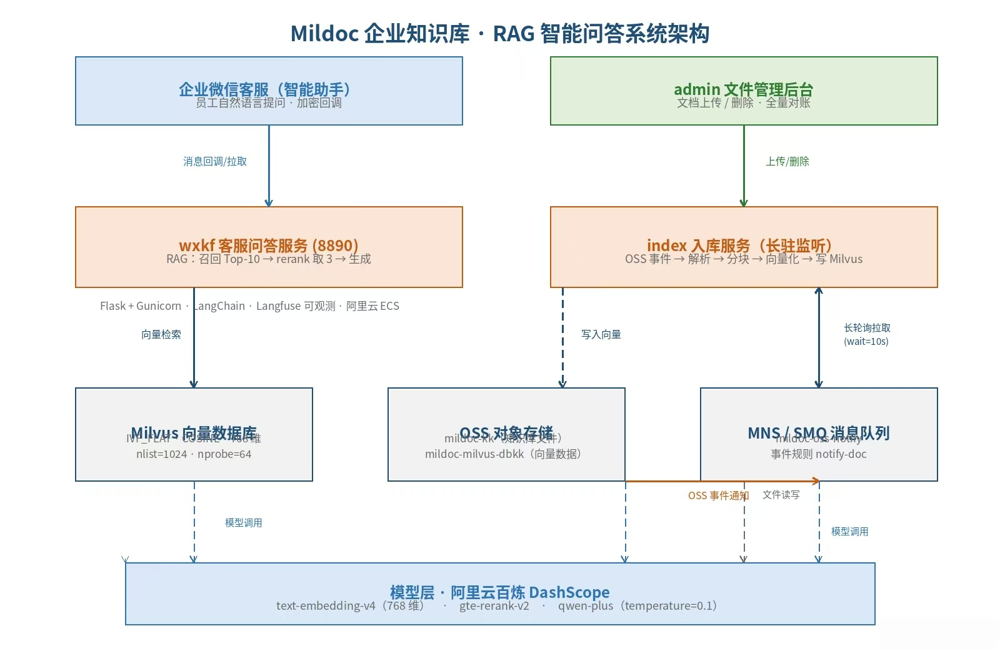
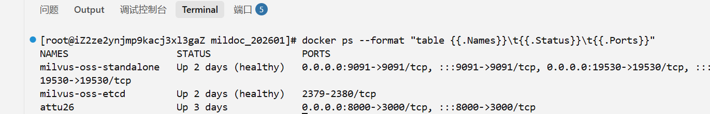
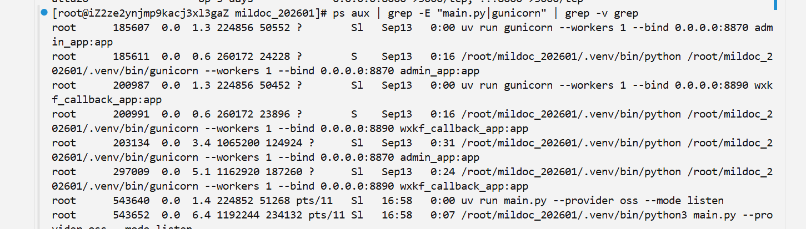
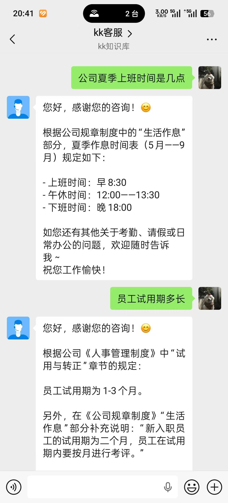
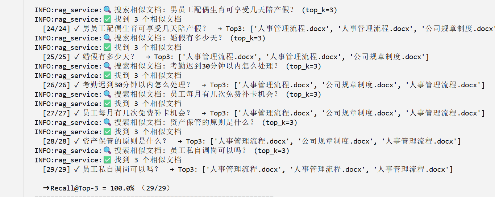
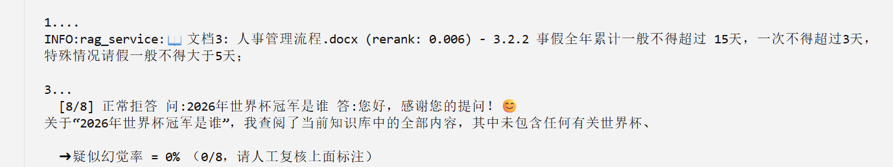
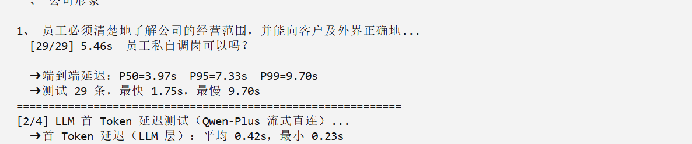

# Mildoc 企业知识库 · 大模型 RAG 智能问答系统

> 企业文档上传即自动入库，员工在企业微信中直接用自然语言提问，系统基于知识库检索生成带依据的答案，答不上自动转人工。



## ✨ 核心特性

- **事件驱动自动入库**：文档上传至对象存储（OSS）触发事件 → MNS 队列解耦 → index 服务自动完成 解析 → 分块 → 向量化 → 写入 Milvus，全程无需人工干预
- **RAG 两级检索**：embedding 向量召回 Top-10 → gte-rerank-v2 交叉编码精排取 3 条进 Prompt，重排带安全检查（最高相似文档强制保回）
- **企业微信客服接入**：回调消息加解密（Token/AES/CorpID 验签）、cursor 增量拉取去重、"转人工"一键转接待池
- **防幻觉设计**：Prompt 三条铁律 + temperature=0.1，知识库外问题明确拒答不编造
- **质量可量化**：内置 benchmark 评测脚本，覆盖延迟 / 首 Token / 召回率 / 幻觉率 / 稳定性 5 项指标

## 📊 评测结果（benchmark.py 实测）

| 指标 | 结果 | 说明 |
|---|---|---|
| Recall@Top-3 | **100%**（29/29） | 29 条真实业务问题全部命中 |
| 幻觉率 | **0%**（0/8） | 8 个知识库外问题全部正确拒答 |
| 端到端延迟 | P50=3.97s / P95=7.33s / P99=9.70s | 检索+重排+生成全链路，最快 1.75s |
| LLM 首 Token | 平均 0.42s / 最小 0.23s | LLM 层流式直连口径 |
| 稳定运行 | 2.9 天+（持续累积） | 日志最早 2026-09-12 19:56:24 |

## 🏗️ 系统架构

```
┌────────────────────────────────────────────────────────────┐
│                        接入层                               │
│   企业微信客服（智能助手）          admin 文件管理后台         │
└───────────────┬───────────────────────────┬────────────────┘
                │ 回调/拉取消息               │ 上传/删除文档
┌───────────────▼───────────────────────────▼────────────────┐
│                        应用层（阿里云 ECS）                  │
│   wxkf 客服问答服务     admin 后台服务      index 入库服务     │
│   (Flask+Gunicorn 8890) (Gunicorn 8870)   (长驻监听 MNS)     │
└───────┬───────────────┬───────────────────────┬─────────────┘
        │               │                       │
        │ 向量检索        │ 上传/删除               │ 事件驱动
┌───────▼──────┐  ┌──────▼──────┐        ┌───────▼──────┐
│    Milvus    │  │    OSS      │◄──────►│     MNS      │
│  向量数据库    │  │ 文件存储     │  事件   │  消息队列     │
│ IVF_FLAT     │  │ mildoc-kk   │  通知   │ mildoc-oss-  │
│ COSINE 768维 │  │             │        │ notify       │
└───────┬──────┘  └──────┬──────┘        └───────┬──────┘
        │                │                      │
┌───────▼────────────────▼──────────────────────▼──────┐
│                 模型层（阿里云百炼 DashScope）            │
│   text-embedding-v4（768 维）  gte-rerank-v2  qwen-plus │
└───────────────────────────────────────────────────────┘
```

- **入库链路**：OSS 事件规则 notify-doc → MNS 队列 → index 长轮询（wait_seconds=10）→ 解析 → 分块 → 向量化 → Milvus
- **问答链路**：企微消息 → wxkf → Milvus 召回 Top-10 → rerank 取 3 → qwen-plus 生成 → 加密回复企微
- **技术要点**：IVF_FLAT 索引（nlist=1024 / nprobe=64）、分块 chunk_size=2048 / overlap=128、RecursiveCharacterTextSplitter

## 🛠️ 技术栈

| 分类 | 技术 |
|---|---|
| 向量数据库 | Milvus v2.6.7 standalone（+ etcd v3.5.25，Docker Compose 部署） |
| 对象存储 / 队列 | 阿里云 OSS（S3 协议兼容 MinIO SDK）、MNS/SMQ 消息队列 |
| 模型（百炼） | text-embedding-v4（768 维）、gte-rerank-v2、qwen-plus（temperature=0.1） |
| 后端框架 | Python、Flask + Gunicorn、LangChain（分块 / LLM 调用）、Langfuse（可观测） |
| 平台接入 | 企业微信开放平台（自建应用 / 客服 / 消息加解密） |
| 部署环境 | 阿里云 ECS（Ubuntu）、Docker Compose、uv、Git |

## 🚀 快速开始

### 1. 配置环境变量（.env）

复制配置模板并填写（**密钥不要提交到 Git**，见文末《上传 GitHub 前》）：

```ini
# 模型（阿里云百炼，OpenAI 兼容协议）
LLM_API_KEY=your_dashscope_api_key
LLM_BASE_URL=https://dashscope.aliyuncs.com/compatible-mode/v1
LLM_MODEL_NAME=qwen-plus

# 向量数据库
MILVUS_HOST=your_milvus_host
MILVUS_PORT=19530
MILVUS_VECTOR_DIM=768

# 对象存储（阿里云 OSS，S3 兼容协议）
MINIO_ENDPOINT=oss-cn-hangzhou.aliyuncs.com:443
MINIO_BUCKET=your_bucket
MINIO_REGION=cn-hangzhou

# 企业微信
WECOM_TOKEN=your_token
ENCODING_AES_KEY=your_encoding_aes_key
CORP_ID=your_corp_id
```

### 2. 启动 Milvus（Docker Compose）

```bash
docker compose -f mildoc_milvus/milvus_oss/docker-compose.yml up -d
# 如路径不同，先执行：find ~/mildoc_202601 -name docker-compose.yml
```

### 3. 启动入库服务（index，长驻监听 MNS 队列）

```bash
cd ~/mildoc_202601/mildoc_index
nohup uv run main.py --provider oss --mode listen >> mildoc_index.log 2>&1 &
```

### 4. 启动问答与后台服务（Gunicorn）

```bash
cd ~/mildoc_202601/mildoc_admin
nohup uv run gunicorn --workers 1 --bind 0.0.0.0:8870 admin_app:app >> mildoc_admin.log 2>&1 &

cd ~/mildoc_202601/mildoc_wxkf
nohup uv run gunicorn --workers 1 --bind 0.0.0.0:8890 wxkf_callback_app:app >> mildoc_wxkf.log 2>&1 &
```

### 5. 运行评测

```bash
cd ~/mildoc_202601/mildoc_wxkf
uv run python benchmark.py
```

## 📂 目录结构

```
mildoc_202601/
├── mildoc_admin/        # 文件管理后台（Flask + Gunicorn :8870）
├── mildoc_index/        # 文档解析入库服务（事件驱动，监听 MNS）
├── mildoc_wxkf/         # 企微客服 + RAG 问答（Flask + Gunicorn :8890）
│   ├── benchmark.py     # 5 项指标评测脚本
│   └── qa_pairs.txt     # 评测 QA 集（问题 | 期望文档 | 期望答案）
├── mildoc_milvus/       # Milvus 部署配置（Docker Compose）
└── pyproject.toml       # 依赖管理（uv）
```

## 📸 运行截图













## ⚠️ 上传 GitHub 前

`.env` 含 OSS / 企微 / LLM 密钥，**严禁入库**。首次推送前确保仓库根目录存在 `.gitignore`：

```gitignore
.env
.env.*
*.log
nohup.out
__pycache__/
*.pyc
.venv/
venv/
```

若 .env 已被跟踪，先执行 `git rm --cached <各 .env 路径>` 解除跟踪再提交。

## 📄 License

MIT
